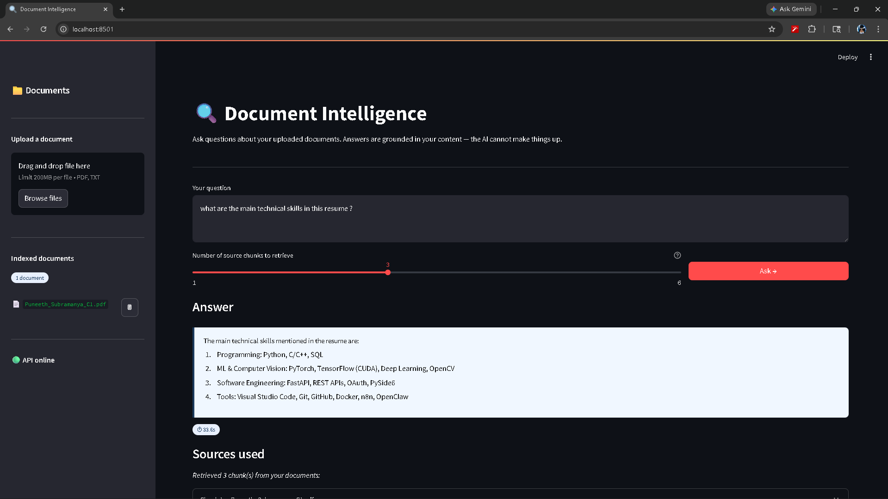

# Document Intelligence API

[](https://github.com/subramanyapuneeth530/doc-intelligence/actions/workflows/ci.yml)

A fully local RAG (Retrieval Augmented Generation) system. Upload PDF or TXT documents, ask questions in natural language, and get answers grounded in your documents — with source references. No API keys required.



---

## Architecture

```
PDF/TXT → Chunking → Embeddings (MiniLM) → ChromaDB
                                                ↓
Question → Embeddings → Similarity Search → Top-K Chunks → Llama 3.2 → Answer
```

## Stack

| Layer | Tool |
|---|---|
| LLM | Llama 3.2 3B via Ollama (fully local) |
| Embeddings | all-MiniLM-L6-v2 (HuggingFace, local) |
| Vector DB | ChromaDB |
| API | FastAPI |
| UI | Streamlit |
| Containerisation | Docker + Docker Compose |
| CI/CD | GitHub Actions |
| Testing | pytest |

---

## Quickstart

### Prerequisites
- Docker Desktop installed and running
- Git

### 1. Clone and start
```bash
git clone https://github.com/subramanyapuneeth530/doc-intelligence.git
cd doc-intelligence
docker-compose up --build
```

First run takes 5–10 minutes (downloads Ollama image + builds API and frontend images).

### 2. Pull the LLM model (one-time, in a new terminal)
```bash
docker exec doc-intel-ollama ollama pull llama3.2
```

### 3. Open the UI
```
http://localhost:8501
```

Upload a PDF or TXT file from the sidebar, then ask any question about it.

---

## Services

| Service | URL | Description |
|---|---|---|
| Streamlit UI | http://localhost:8501 | User-facing interface |
| FastAPI docs | http://localhost:8000/docs | REST API (Swagger UI) |
| Ollama | http://localhost:11434 | Local LLM server |

---

## API Endpoints

| Method | Endpoint | Description |
|---|---|---|
| GET | `/health` | Health check |
| POST | `/ingest` | Upload and index a PDF or TXT file |
| POST | `/query` | Ask a question, get answer + sources |
| GET | `/sources` | List all indexed documents |
| DELETE | `/source/{filename}` | Remove a document from the index |

---

## Running locally without Docker

```bash
# Install Ollama from ollama.com and pull the model
ollama pull llama3.2

# Create venv and install deps
python -m venv .venv
.venv\Scripts\activate      # Windows
pip install -r requirements.txt

# Terminal 1 — run the API
uvicorn app.main:app --reload

# Terminal 2 — run the UI
streamlit run frontend.py
```

## Running tests

```bash
pytest tests/ -v
```
